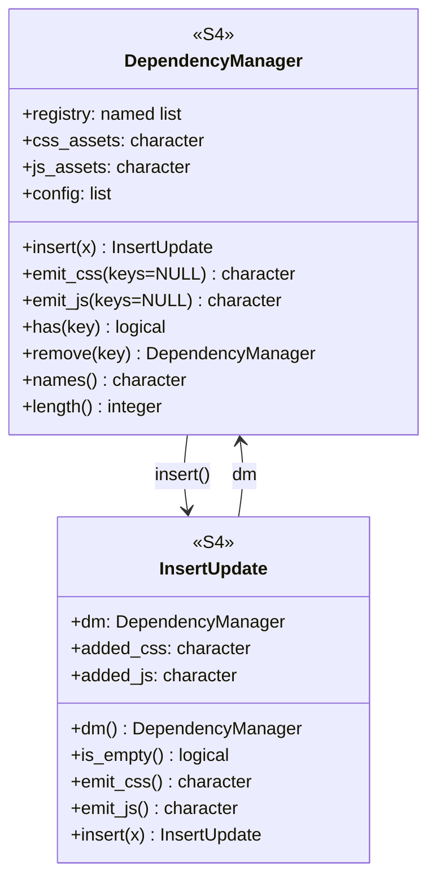
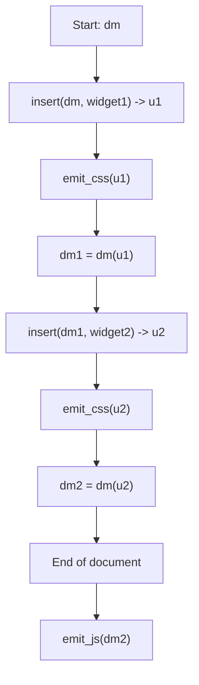

# DESIGN.md — depkit

## Overview

**depkit** is a build-time HTML asset and dependency manager for R.

It manages **CSS and JavaScript assets** produced by R tooling (notably `htmlwidgets`) and provides a deterministic, usage-agnostic way to:

- deduplicate assets,
- preserve first-seen ordering,
- copy local assets into a target directory,
- optionally apply verified CDN logic for JavaScript, and
- **emit HTML snippets** (`<link>`, `<script>`) for callers to insert into documents they are constructing.

depkit **does not** write HTML files, track what has been emitted, or impose document layout policy.

---

## Sharpened focus

### depkit does

- Track CSS and JS assets as **ordered unique sets**
- Deduplicate dependencies by `name@version`
- Copy local assets into a configured output directory
- Optionally verify and emit CDN-backed JavaScript with fallback
- Emit HTML snippets for either:
  - newly added assets, or
  - all known assets (ordered, deduped)

### depkit does not

- Write complete HTML documents
- Track whether assets were emitted or not
- Decide where snippets belong in a document
- Maintain “prepared” or “emitted” state
- Integrate with site generators (Hugo, etc.)

---

## Core concepts

### Dependency key

A dependency is uniquely identified by:

```r

dep_key = paste0(dep$name, "@", dep$version)

```

This key is used for registry deduplication.

---

### Asset id

An asset is uniquely identified by:

```r

asset_id = paste0(dep_key, "::", rel_path)

```

Where `rel_path` is the stylesheet or script path declared by the dependency.

Asset ids are:
- stable
- output-agnostic
- the sole unit tracked by the dependency manager

URL resolution and filesystem paths are derived later.

---

## Architecture

depkit has **two public classes** and **one internal representation**.

---

## Class diagram



---

## DependencyManager

### Responsibilities

The `DependencyManager` (DM) holds the **only persistent state** in depkit:

* dependency registry (deduped by `dep_key`)
* ordered unique CSS asset ids
* ordered unique JS asset ids
* configuration (Option A)

### Configuration (Option A)

Configuration is stored on the DM and applies uniformly:

* `output_root` — filesystem directory for copied assets
* `url_root` — URL prefix used in emitted tags
* `cdn_mode` — `"off"` or `"verify"` (JavaScript only)

Configuration affects copying and emission, but is **not stateful** in the sense of “prepared” or “emitted”.

---

## InsertUpdate (delta + façade)

### Purpose

`InsertUpdate` is a **higher-level API object** that:

* captures “what changed” during an insertion
* delegates emission back to the DM
* reduces caller reasoning burden

It is **not** plumbing and introduces no new capability.

---

## Insert semantics

### `insert(dm, x)`

Insertion is functional:

1. Normalize input (`html_dependency`, `htmlwidget`, list)
2. Resolve dependencies and their assets into asset ids
3. Compare asset ids to DM’s ordered sets

#### Case 1: Already present

* No new asset ids discovered
* No files copied
* Return `InsertUpdate` with empty `added_css` / `added_js`
* DM is returned unchanged

#### Case 2: New assets discovered

* Extend DM’s ordered sets with new asset ids
* Copy local asset files for **new assets only**

  * overwriting is allowed
  * skipping identical files is preferred but optional
* Return `InsertUpdate` containing only newly added asset ids

### Key invariant

> **DM never tracks whether assets were emitted or prepared.**
> It only tracks **what assets exist**, in order.

---

## Emission model

### Emission via InsertUpdate (new-only)

```r
u <- insert(dm, widget)
html <- emit_css(u)
```

* Emits snippets **only for newly added assets**
* Implemented by calling DM emission with `keys = added_asset_ids`
* Does not mutate DM or InsertUpdate

---

### Emission via DependencyManager (all assets)

```r
html_css <- emit_css(dm)
html_js  <- emit_js(dm)
```

* Emits all assets of the given type
* Preserves first-seen order
* No deduplication logic required at emit time

---

## Internal asset records (implementation detail)

depkit constructs **ephemeral asset records** internally during:

* insertion (for copying)
* emission (for tag generation)

These records are **not stored** and **not part of public API**.

### Conceptual structure

Each internal asset record contains:

Common:

* `asset_id`
* `kind` (`css` / `js`)
* `dep_key`
* `rel_path`
* `src_dir`
* `out_path`
* `url`

JavaScript only (when `cdn_mode = "verify"`):

* `cdn_url` (optional)
* `integrity` (sha384)
* `fallback_url`
* `verified` flag

Records are derived deterministically from:

* DM state
* configuration
* filesystem inspection

---

## Emission behavior

### CSS

* Always local-only
* Emitted as:

```html
<link rel="stylesheet" href="URL">
```

### JavaScript

* `cdn_mode = "off"`

  * Emit local `<script src="URL"></script>`

* `cdn_mode = "verify"`

  * Verify CDN content matches local bytes
  * If verified:

```html
<script src="CDN_URL"
        integrity="sha384-..."
        crossorigin="anonymous"
        onerror="this.onerror=null;this.src='LOCAL_URL';">
</script>
```

* If verification fails: emit local-only

---

## Typical workflow (caller-defined policy)

Example: “emit CSS as encountered, JS at end”



depkit enables this policy but does not enforce it.

---

## Error handling philosophy

* Malformed dependencies → hard error
* Asset copy failure → hard error
* CDN verification failure → warning + local fallback
* Network failures are never fatal

depkit always **fails closed** to local assets.

---

## Coding style guidance

* **Avoid probing-for-correctness**

  * Use explicit class checks; fail fast
* **Keep porcelain thin**

  * S4 orchestrates; logic lives in utilities
* **Determinism over cleverness**

  * Preserve insertion order; no implicit sorting
* **No hidden state**

  * No “prepared”, “emitted”, or “already handled” flags

---

## Summary

depkit provides a clean, deterministic boundary:

* **DependencyManager** — canonical asset state
* **InsertUpdate** — explicit delta + ergonomic emission
* **Insert** — may copy new assets
* **Emit** — returns HTML snippets, nothing more

Callers decide *where* snippets go.
depkit decides *what* those snippets are.
